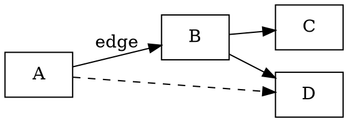
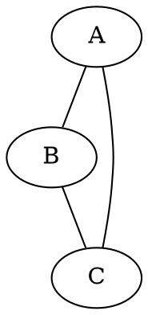
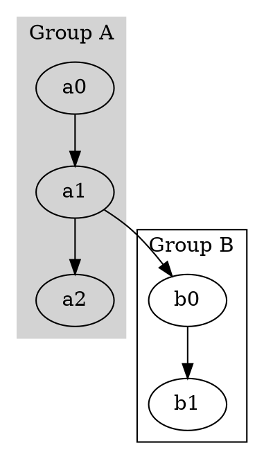
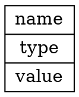

# Graphviz

Graph visualization tools. Render diagrams from DOT language descriptions.

---

## Layout Engines

| Command | Best For |
|---------|----------|
| `dot` | Directed graphs (hierarchical, top-to-bottom) |
| `neato` | Undirected graphs (spring model) |
| `fdp` | Undirected graphs (force-directed) |
| `sfdp` | Large undirected graphs (scalable fdp) |
| `circo` | Circular layouts |
| `twopi` | Radial layouts |

## Basic Usage

```bash
dot -Tpng graph.gv -o graph.png
dot -Tsvg graph.gv -o graph.svg
dot -Tpdf graph.gv -o graph.pdf
neato -Tpng graph.gv -o graph.png
echo 'digraph { a -> b }' | dot -Tpng -o out.png
```

## Key Flags

| Flag | Action |
|------|--------|
| `-T FORMAT` | Output format (`png`, `svg`, `pdf`, `ps`, `jpg`, `dot`) |
| `-o FILE` | Output file |
| `-K ENGINE` | Layout engine (`dot`, `neato`, etc.) |
| `-G ATTR=VAL` | Set graph attribute |
| `-N ATTR=VAL` | Set default node attribute |
| `-E ATTR=VAL` | Set default edge attribute |
| `-s SCALE` | Scale factor |

## DOT Language

### Directed Graph



### Undirected Graph



## Node Attributes

| Attribute | Values |
|-----------|--------|
| `shape` | `box`, `circle`, `ellipse`, `diamond`, `record`, `plaintext`, `point`, `doublecircle` |
| `label` | Display text |
| `color` | Border color |
| `fillcolor` | Fill color (needs `style=filled`) |
| `style` | `filled`, `bold`, `dashed`, `rounded`, `invis` |
| `fontname` | Font family |
| `fontsize` | Font size |
| `fontcolor` | Text color |
| `width` / `height` | Minimum size |

## Edge Attributes

| Attribute | Values |
|-----------|--------|
| `label` | Edge label text |
| `color` | Edge color |
| `style` | `solid`, `dashed`, `dotted`, `bold`, `invis` |
| `arrowhead` | `normal`, `inv`, `dot`, `none`, `vee`, `diamond` |
| `dir` | `forward`, `back`, `both`, `none` |
| `weight` | Layout priority (higher = straighter) |
| `penwidth` | Line thickness |

## Graph Attributes

| Attribute | Values |
|-----------|--------|
| `rankdir` | `TB` (top-bottom), `LR`, `BT`, `RL` |
| `bgcolor` | Background color |
| `label` | Graph title |
| `fontsize` | Title font size |
| `splines` | `true`, `false`, `ortho`, `curved`, `polyline` |
| `overlap` | `true`, `false`, `scale` (neato) |
| `nodesep` | Space between nodes |
| `ranksep` | Space between ranks |

## Subgraphs / Clusters



## Record Nodes


